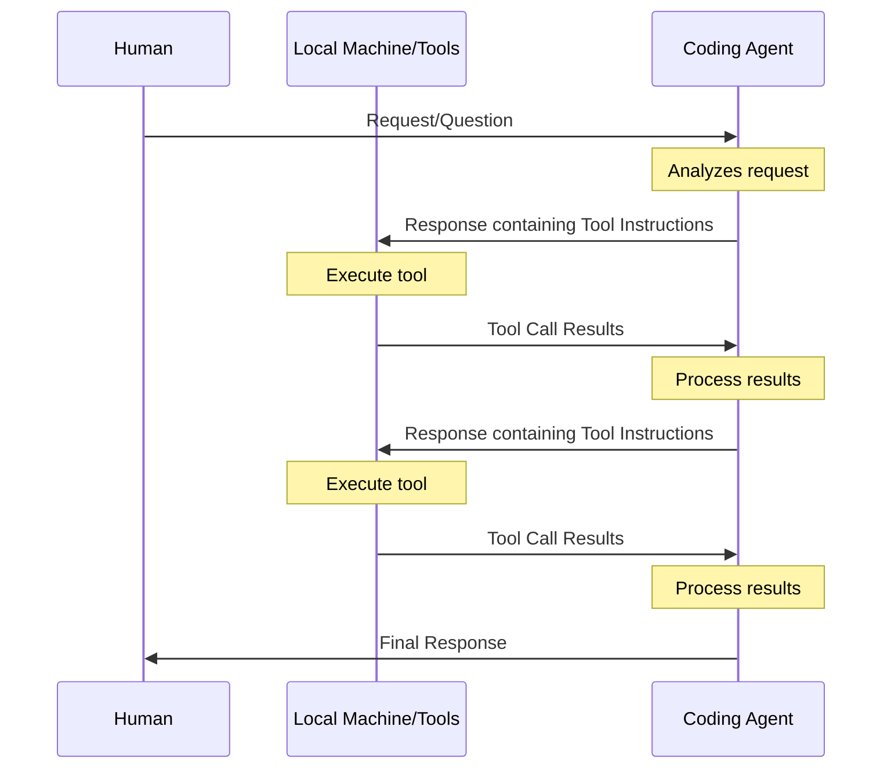

# Conversational Agents

- Constrained by context window
- Each new interaction requires processing ALL previous context
- It is trained to use tools, not only talk
- It needs your support
- MCP

<!--
## Model differences
Claude 4 Sonnet was specifically trained to use tools and follow instructions effectively. This makes it particularly well-suited for agentic workflows where precise tool usage is critical.

ChatGPT 4.1 struggles more with consistent tool behavior - it sometimes has difficulty maintaining the same level of precision when executing tool calls and following complex multi-step instructions.

## The challenge of tool abstraction
The core challenge: How does the agent know if an operation partially succeeded? How do you communicate complex state changes without burning through your context window?

Example: A gradle build command might return 10,000 lines of output, but the agent only needs to know "build failed at test X with assertion Y."

## Design considerations
Designing these tool abstractions is an art form:
- When a tool fails, what information does the agent need to recover?
- Too little information and it's stuck
- Too much and you waste precious context
- The sweet spot: just enough context to make intelligent decisions

MCP (Model Context Protocol) helps standardize these interactions, but the abstraction layer design remains crucial for effective agent performance.
-->
