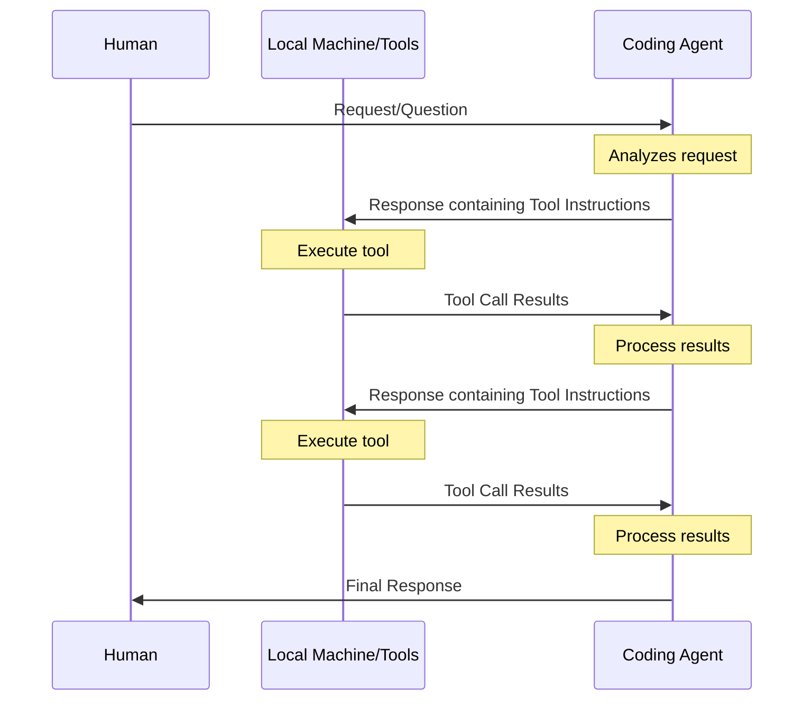

# Conversational Agents

- Constrained by context window
- Each new interaction requires processing ALL previous context
- It is trained to use tools, not only talk
- It needs your support
- MCP

<!--
The "agentic" coding tools we have right now work like this:

A skilled individual with both deep domain understanding and deep understanding of the capabilities of the agent (including understanding what tools are available to that agent) poses a clear task to it.

The agent writes some code relating to that task. It runs a tool to execute and test that code. It inspects the result, and if there are errors it edits the code and tries again.

It may call other tools as well, for example a search tool to find related code or even to look up API documentation elsewhere (including via web search).

It continues like this until it hits a loosely defined "done" state or gets stuck.

The skilled individual then reviews what it has done and almost always finds that it has not solved the problem to their satisfaction... so they apply their expertise and domain understanding to prompt it again to try and get to that desired state.

Without the skilled individual, the "agent" is useless. It may as well not exist.
-->
