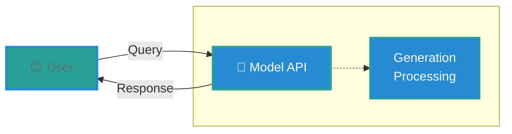

# Minimal AI Application Architecture

```mermaid
graph LR
    A[😊 User] -->|Query| B[🤖 Model API]
    B -->|Response| A

    subgraph API [" "]
        B
        C[Generation<br/>Processing]
        B -.-> C
    end

    classDef userStyle fill:#2aa198,stroke:#268bd2,stroke-width:3px,color:#586e75
    classDef apiStyle fill:#268bd2,stroke:#2aa198,stroke-width:3px,color:#fdf6e3
    classDef genStyle fill:#268bd2,stroke:#2aa198,stroke-width:2px,color:#fdf6e3

    class A userStyle
    class B apiStyle
    class C genStyle
```

  <em>The simplest architecture for running an AI application</em>

